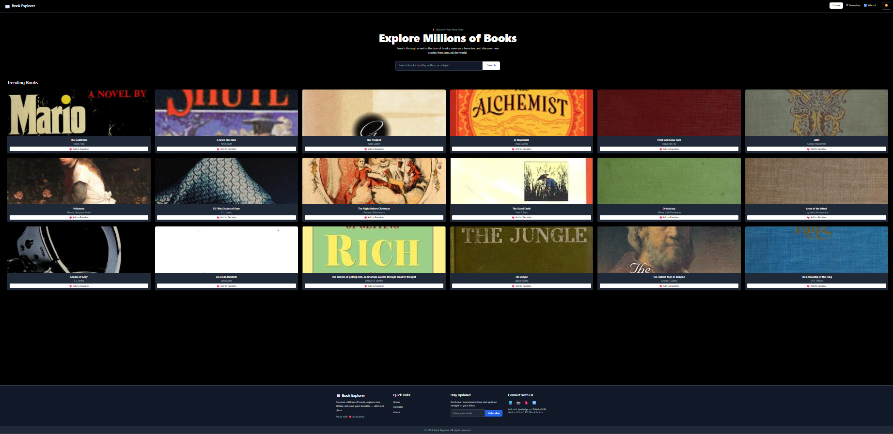
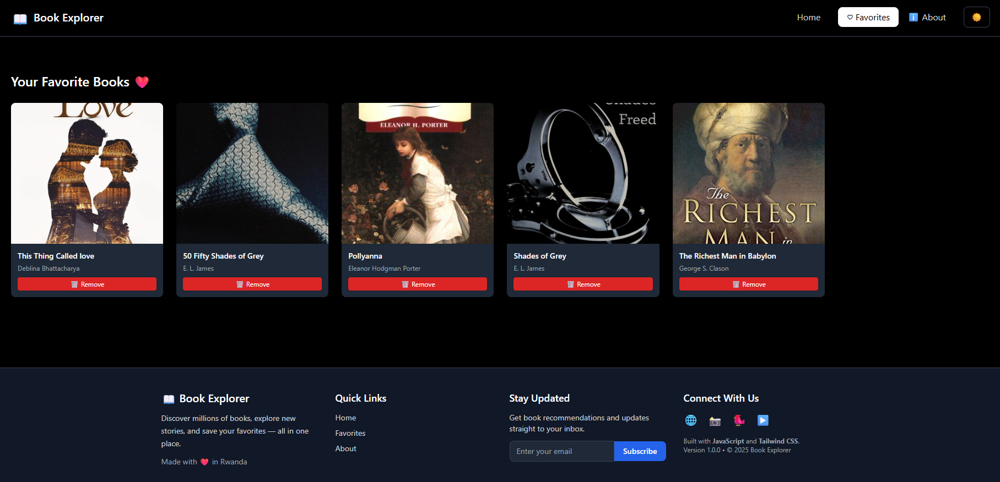
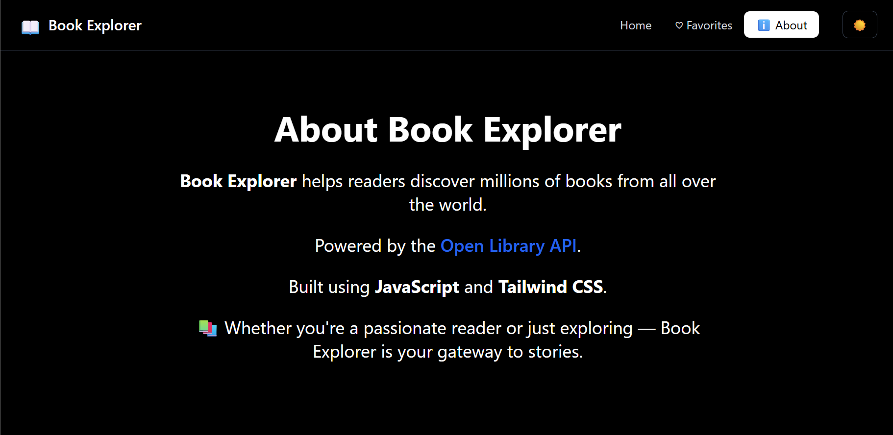
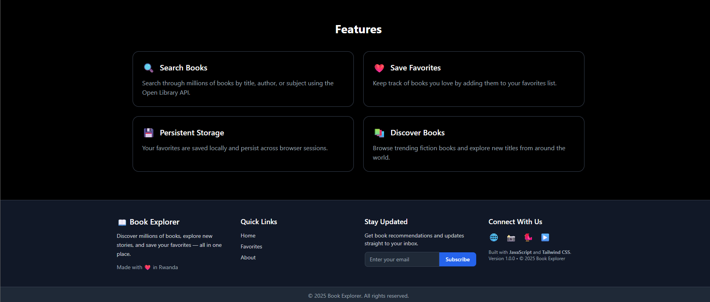

# 📚 Book Explorer

> **A responsive and interactive web app to explore, search, and favorite books using the Open Library API.**

[](https://opensource.org/licenses/MIT)  
[](https://github.com/your-username/book-explorer/stargazers)  

---

## **Project Overview**

**Book Explorer** is a responsive and interactive web application that lets users **browse, search, and favorite books** using data from the **Open Library API**.  
Built with **HTML, Tailwind CSS, and JavaScript (ES6 modules)**, this project emphasizes **modular code**, **dynamic UI updates**, and **API integration**.

**Live Demo:** *(if deployed, add your URL here)*  

---

## **Features**

- Browse trending books fetched from the Open Library API.  
- Search books by title, author, or subject.  
- Add and remove books from a personalized favorites list.  
- Persistent favorites using **localStorage**.  
- Light/Dark mode toggle.  
- Fully responsive for mobile, tablet, and desktop screens.  
- Modular JavaScript for maintainability (`fetchBooks.js`, `favorites.js`, `main.js`).  

---

## **Technologies Used**

- **HTML5** – Structure of the app  
- **Tailwind CSS** – Styling and responsive design  
- **JavaScript (ES6 modules)** – Dynamic functionality  
- **Fetch API** – Fetch book data asynchronously  
- **localStorage** – Store user favorites  

---

## **Screenshots**

### Home Page
![Home Page Screenshot]

### Favorites Page
![Favorites Page Screenshot]

### About Page
![About page screenshot]

---

## **Installation & Setup**

1. **Clone the repository**
   ```bash
   git clone https://github.com/Boldecca/Phase_One_Capstone_Project.git
.
---

2. **Deployment**

live mode:  https://boldecca.github.io/Phase_One_Capstone_Project/

---

Book-Explorer/
│
├── index.html           # Homepage
├── favorites.html       # Favorites page
├── about.html           # About page
├── main.js              # Main app logic
├── fetchBooks.js        # API Manager
├── favorites.js         # Favorites Manager
├── style.css            # Optional custom styles
└── README.md

Contact

Created by Your Name
📧 muteterirebecca60@example.com

🐙 @Boldecca